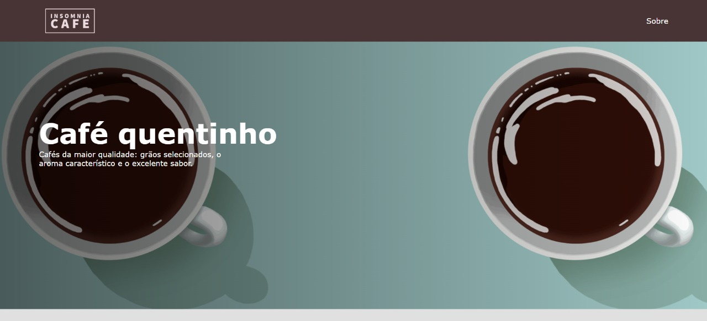

# Projeto-Final-MJVSchool :coffee: Insomnia Cafe
## Projeto Final desenvolvido por **Leonardo Alves** do curso de Angular e Typescrit da MJV School.

Tendo como inspiração a cafeteria do *sitcom* **FRIENDS**, foi decidido que a vitrine virtual seria de uma cafeteria chamada **Insomnia Cafe**, que era o nome original dessa série.:coffee:

A proposta foi deixar o site o mais *clean* possível, utilizando tons terrosos na paleta de cores, remetendo ao próprio café.

## Feito Com:

## Status do projeto 🚀
#### Em desenvolvimento.

## Autor

<a href="https://github.com/leomonadas">
 
  
 <b>Leonardo Alves</b></a> <a href="https://github.com/leomonadas" title="GitHub">🚀</a>

👋🏽 Entre em contato!

   
  
    
  

## 📝 Licença

Esse projeto está sob licença. Veja o arquivo [LICENÇA](LICENSE) para mais detalhes.
